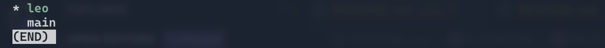

# README

Voici le repo du projet e4 R7 sur la reconnaissance d'utilisateur de smartwatch. 

## Pour commencer

Pour cloner le repo, utilisez la commande suivante:

```bash
git clone https://github.com/appollo30/projet-e4.git
````

Vous devrez alors avoir accès au projet.

Ensuite, créez votre propre branche pour travailler sur le projet. C'est ici que vous pourrez faire vos modifications.

```bash
git checkout -b votre-prenom
```

Pour vérifier que vous êtes bien sur votre branche, utilisez la commande suivante:

```bash
git branch
```

Normalement vous devriez voir une astérisque devant votre branche.


Vous pouvez alors commencer à travailler sur le projet.

Quand vous avez fini de travailler sur votre branche, vous pouvez ajouter vos modifications avec la commande suivante:

```bash
git add .
git commit -m "Ce que j'ai fait comme modifications"
git checkout main
git merge votre-prenom
```

Vous pouvez alors push vos modifications sur le repo avec la commande suivante:

```bash
git push origin main
```

N'oubliez pas enfin de retourner sur votre branche avec la commande suivante:

```bash
git checkout votre-prenom
```

N'OUBLIEZ PAS DE PUSH QUAND VOUS AVEZ FINI DE TRAVAILLER SUR VOTRE BRANCHE.

Quand vous revenez sur votre branche après avoir push, vous pouvez pull les modifications de la branche main avec la commande suivante:

```bash
git pull origin main
```
